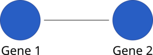
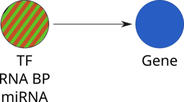
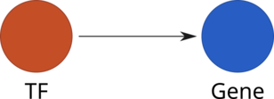

class: center, middle, title-slide
background-color: black
background-image: url(image/intro_background.png)

# ISCB DC RSG 2016 Summer Workshop
## Co-expression network analysis using RNA-Seq data 
#### V. Keith Hughitt
##### June 15, 2016

---

# Outline

--
**1. Background**

--
- Types of biological networks

--
- Methods for co-expression network construction

--
- Considerations for using RNA-Seq data

--
- Co-expression network construction

--
- Co-expression network annotation

--
- Data used for today's presentation
--


**2. Tutorial**
--


**3. Questions/Discussion**

---
# Types of Biological Networks

Biological networks have been used to study a range of processes in recent
years:

--
### Protein-protein Interaction Network (PPI)
<br /><br /><br />


.center[]

???
- Nodes and Edges
- Directed vs. Undirected.

---
# Types of Biological Networks

Biological networks have been used to study a range of processes in recent
years:

### Co-expression Network
<br /><br /><br />


.center[]

---
# Types of Biological Networks

Biological networks have been used to study a range of processes in recent
years:

### Gene-regulatory Network (GRN)
<br /><br /><br />


.center[]

---
# Types of Biological Networks

Biological networks have been used to study a range of processes in recent
years:

### Transcriptional-regulatory Network (TRN)
<br /><br /><br />


.center[]

---
# Types of Biological Networks

Biological networks have been used to study a range of processes in recent
years:

### Metabolic Network 
<br /><br /><br />


.center[]


---
# Network representations

```r
set.seed(1)

# create a 5x5 binary matrix
adj <- matrix(sample(c(0,1), 25, replace=TRUE), nrow=5)

# set diagonal to zero (no self-loops)
diag(adj) <- 0
```

<br />

.left-column.vcenter[

|   | V1| V2| V3| V4| V5|
|:--|--:|--:|--:|--:|--:|
|V1 |  0|  1|  0|  0|  1|
|V2 |  0|  0|  0|  1|  0|
|V3 |  1|  1|  0|  1|  1|
|V4 |  1|  1|  0|  0|  0|
|V5 |  0|  0|  1|  1|  0|

]

.right-column.vcenter[

]

???

Plotting: 

```r
library(igraph)
svg(file='example-network-directed.svg', bg='transparent')
plot(g)
dev.off()

# for separate edges in each direction
#plot(g, edge.curved=rep(0.5, ecount(g)))
```

---
class: center, middle

## Thank you!

---

## Acknowledgements


.left-column[
#### El-Sayed Lab

- Najib El-Sayed
- April Hussey, Lab manager
- Trey Belew, Ph.D., Post-doc
- Saloe Bispoe, Ph.D., Post-doc
- Maddy Paulson, Undergrad RA

#### Community

- MPRI
- CBCB
- BYOB
- ISCB
]

.right-column[
#### Collaborators

- Hector Corrada-Bravo (UMD)
- David Mosser (UMD)
- Volker Briken (UMD)
- Barbara Burleigh (Harvard)
- Rebecca Manning (Cinvestav)
- Jeronimo Ruiz (Fiocruz)
- David Sacks (NIH)
- Ehud Inbar (NIH)
]


