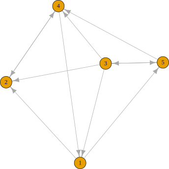
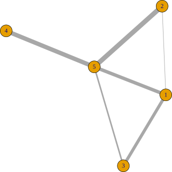
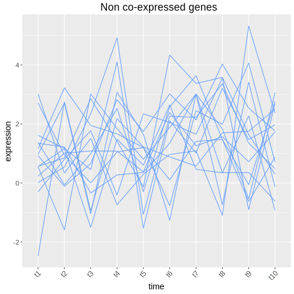

class: center, middle, title-slide
background-color: black
background-image: url(image/intro_background.png)

# ISCB DC RSG 2016 Summer Workshop
## Co-expression network analysis using RNA-Seq data 
#### V. Keith Hughitt
##### June 15, 2016

---
class: smaller

# Outline

--
**1. Background**

--
- Types of biological networks

--
- Motivation for using co-expression networks

--
- Approaches for co-expression network inference

--
- Basic graph terminology and data structures

--
- Steps for building a co-expression network

--
- Dataset for today's workshop


--
**2. Tutorial**

--
- Preparing RNA-Seq data for network construction

--
- Building a co-expression network

--
- Detecting co-expression modules

--
- Annotating a co-expression network

--
- Visualizing our network


--
**3. Questions/Discussion**

---
# Types of Biological Networks

Biological networks have been used to study a range of processes in recent
years:

--
### Protein-protein Interaction Network (PPI)
<br /><br /><br />

.center[]

???
- Graphs/networks (useful link: https://shapeofdata.wordpress.com/2013/08/13/graphs-and-networks/)
- Vertices and Edges (nodes and links)
- Directed vs. Undirected.
- Weighted vs. Unweighted
- For our purposes: interested in representing relationship between numerous
  (molecules) in a cell, both in general, and across specific conditions,
  tissues, etc.

---
# Types of Biological Networks

Biological networks have been used to study a range of processes in recent
years:

### Co-expression Network
<br /><br /><br />


.center[]

---
# Types of Biological Networks

Biological networks have been used to study a range of processes in recent
years:

### Gene-regulatory Network (GRN)
<br /><br /><br />


.center[]

---
# Types of Biological Networks

Biological networks have been used to study a range of processes in recent
years:

### Transcriptional-regulatory Network (TRN)
<br /><br /><br />


.center[]

---
# Types of Biological Networks

Biological networks have been used to study a range of processes in recent
years:

### Metabolic Network 
<br /><br /><br />


.center[]

---
class: smaller

# What are co-expression networks useful for?

--
1. **Common approaches for analyzing expression data**

--
    - Differential expression analysis

--
    - Gene set enrichment analysis (GO/KEGG)

--
2. **Limitations of these approaches**

--
    - Typically limited to <span class='blue'>pairwise comparisons</span> (e.g. infected vs. uninfected)

--
    - Provides only a <span class='blue'>broad overview</span> of which genes or functions are up- and down-regulated between conditions

--
3. **Co-expression network analysis**

--
    - Uses expression data for <span class='red'>multiple conditions</span> (e.g. time-points) to infer relationships between genes.

--
    - Useful for understanding patterns in expression data at a more granular level

--
    - Can <span class='red'>detect sub-groups</span> corresponding to different expression profiles

--
    - Can be used to <span class='red'>infer function</span> of unknown gene products

---

---
# Network representation (directed)

```r
set.seed(1)

# create a 5x5 binary matrix
adj <- matrix(sample(c(0,1), 25, replace=TRUE), nrow=5)

# set diagonal to zero (no self-loops)
diag(adj) <- 0
```

<br />

.left-column.vcenter[

### Adjacency Matrix

|   | V1| V2| V3| V4| V5|
|:--|--:|--:|--:|--:|--:|
|V1 |  0|  1|  0|  0|  1|
|V2 |  0|  0|  0|  1|  0|
|V3 |  1|  1|  0|  1|  1|
|V4 |  1|  1|  0|  0|  0|
|V5 |  0|  0|  1|  1|  0|

]

.right-column.vcenter[

]

---
# Network representation (undirected)

```r
# convert to undirected network
adj[upper.tri(adj)] <- 0

# plotting with igraph
g <- graph.adjacency(adj, mode='undirected')

plot(g)
```

<br />

.left-column.vcenter[

### Adjacency Matrix

|   | V1| V2| V3| V4| V5|
|:--|--:|--:|--:|--:|--:|
|V1 |  0|  0|  0|  0|  0|
|V2 |  0|  0|  0|  0|  0|
|V3 |  1|  1|  0|  0|  0|
|V4 |  1|  1|  0|  0|  0|
|V5 |  0|  0|  1|  1|  0|

]

.right-column.vcenter[

]

---
# Network representation (weighted)

```r
# create a weight adjacency matrix
adj <- matrix(rnorm(25, mean=3.5, sd=5), nrow=5)
adj[upper.tri(adj, diag=TRUE)] <- 0

# note that igraph ignores edges with negative weights
g <- graph.adjacency(adj, mode='undirected', weighted=TRUE)
plot(g, edge.width=E(g)$weight)
```

<br />

.left-column.vcenter[

### Adjacency Matrix

|   |    V1|   V2|    V3|    V4|    V5|
|:--|-----:|----:|-----:|-----:|-----:|
|V1 | -6.32| 7.25|  2.94| -5.36| -0.83|
|V2 |  2.68| 1.97|  5.66|  0.61| -1.36|
|V3 |  4.67| 3.77| -5.32| -1.57|  4.84|
|V4 |  8.80| 0.97|  1.13|  0.70|  8.40|
|V5 |  8.91| 6.24|  4.07| -2.61| 11.60|

]

.right-column.vcenter[

]

---
# Co-expression analysis

Let's start by simulating some "expression" data:
- 45 genes
- 3 clusters (high, medium, and low co-expression)

```r
genes_per_cluster <- 15
num_timepoints <- 10

nvals <- genes_per_cluster * num_timepoints

# highly co-expressed cluster going from low->high expression
cluster1 <- matrix(rep(1:num_timepoints, genes_per_cluster) + 
                   rnorm(nvals, sd=0.25),
                   nrow=genes_per_cluster, byrow=TRUE)

# moderately co-expression cluster going from high->low expression
cluster2 <- matrix(rep(num_timepoints:1, genes_per_cluster) + 
                   rnorm(nvals, sd=0.75),
                   nrow=genes_per_cluster, byrow=TRUE)

# randomly expressed genes
noise <- matrix(sample(1:2, nvals, replace=TRUE) +
                rnorm(nvals, sd=1),
                nrow=genes_per_cluster, byrow=TRUE)

```

---
# Cluster 1 (highly co-expressed)

.center[]

---
# Cluster 2 (moderately co-expressed)

.center[]

---
# Cluster 3 (random)

.center[]

---
# Putting it all together...

.center[]

---

```r
```

---
class: center, middle

## Thank you!

---

## Acknowledgements


.left-column[
#### El-Sayed Lab

- Najib El-Sayed
- April Hussey, Lab manager
- Trey Belew, Ph.D., Post-doc
- Saloe Bispoe, Ph.D., Post-doc
- Maddy Paulson, Undergrad RA

#### Community

- MPRI
- CBCB
- BYOB
- ISCB
]

.right-column[
#### Collaborators

- Hector Corrada-Bravo (UMD)
- David Mosser (UMD)
- Volker Briken (UMD)
- Barbara Burleigh (Harvard)
- Rebecca Manning (Cinvestav)
- Jeronimo Ruiz (Fiocruz)
- David Sacks (NIH)
- Ehud Inbar (NIH)
]


